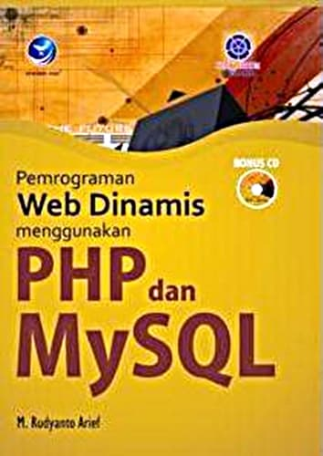

<!-- Garis Lurus -->
 
<!-- End -->

<h1 align="center">Pemprograman Web Dinamis</h1>
<!-- Garis Lurus -->
 
<!-- End -->

<!-- Gambar -->

    
  

  

<!-- Garis Lurus -->
 
<!-- End -->

# Toko Buku Online
   **Toko Buku Online** ini saya pelajari dari buku  **Pemprograman Web Dinamis menggunakan PHP dan Mysql** , sehingga saya gabungkan kedalam repository.
  Dalam buku tersebut, Terdapat CD dan saya gabungkan ke dalam github.

  
     Hingga saat ini pemrograman web masih didominasi oleh PHP & MySQL sebagai pondasi dasar setiap
     aplikasi website yang dibuat. Buku ini mencoba membahas lengkap pemrograman web dengan
     memanfaatkan PHP sebagai programming language dan MySQL sebagai databasenya. Pembahasan buku
     ini terkait dengan pemahaman dasar pemrograman web, pengenalan komponen hingga pemahaam 
     logika pemrograman dan pengaplikasiannya dalam pembuatan aplikasi. Garis besar dari materi 
     buku ini meliputi : 

     1. pemrograman web 
     2. HTML 
     3. PHP 
     4. variabel dan konstanta 
     5. type data dan operator 
     6. Struktur kendali 
     7. Array 
     8. Fungsi 
     9. Form 
     10. Session 
     11. Database MySQL dan koneksi PHP 
     12. Pembuatan web sederhana 
     13. CMS (Content Management System) 
     14. Studi kasus e-commerce toko buku online 
     15. Studi kasus e-commerce toko handphone online

<!-- Garis Lurus -->
 
<!-- End -->

##  Penulis Buku 

     M Rudy Arief
     Dosen Informatika
     Falkultas Ilmu Komputer
     Universitas Amikom Yogyakarta

 <!-- Garis Lurus -->
 
<!-- End -->

## Deskripsi Buku

|              |                                           |
|--------------|------------------------------------------------------|
|    Judul     |    [Pemprograman Web Dinamis Menggunkan PHP dan MySQL]((https://openlibrary.telkomuniversity.ac.id/home/catalog/id/21889/slug/pemrograman-web-dinamis-menggunakan-php-dan-mysql.html)) |
|    Penerbit  |    [M Rudyanto Arief](https://www.bukukita.com/searchresult.php?page=1&id=2&match=1&key=M.+Rudyanto+Arief+%28STIMIK+AMIKOM%29)  |
|  No ISBN     |    9789792927597  |
|    Penerbit  |    [ANDI PUBLISHER](https://www.bukukita.com/searchresult.php?id=3&key=35)  |
| Tanggal Terbit |  2012 |
| Jumlah Halaman |  452  |
| Berat        |    604 gr    |
| Jenis Cover  |    Soft Cover     |
| Kategori     |    Web Programming     |
| Bahasa       |    Indonesia      |
|   Harga      | [Rp. 120.000](https://www.bukukita.com/Komputer-dan-Internet/Web-Programming/106418-Pemrograman-Web-Dinamis-Menggunakan-PHP-dan-MySQL.html)    |
| Link pdf.    | [Buku Web Dinamis - Klik disini](https://amikomac-my.sharepoint.com/:b:/g/personal/bagusbudi1308_students_amikom_ac_id/EU0v8IuWrpRHl_1-4OvDUDAB2KRx2diSlL1e0FR12MTOjw?e=4nucvl)  |

 <!-- Garis Lurus -->
 
<!-- End -->
    

<!-- ## Buku Buku
   
| Judul Buku    | Harga Buku |
|---------------|-------------|
| [Buku Pemprograman Web Dinamis menggunakan PHP dan Mysql](https://openlibrary.telkomuniversity.ac.id/home/catalog/id/21889/slug/pemrograman-web-dinamis-menggunakan-php-dan-mysql.html) | [Rp. 120.000](https://www.bukukita.com/Komputer-dan-Internet/Web-Programming/106418-Pemrograman-Web-Dinamis-Menggunakan-PHP-dan-MySQL.html) |

-->

## Berkontribusi

Siapapun dapat berkontribusi pada proyek ini mulai dari pemrograman, pembuakan buku manual, sampai dengan mengenalkan produk ini kepada kalangan mahasiswa dalam rangka untuk belajar agar mengurangi kesenjangan pendidikan teknologi dengan cara membuat postingan issue di repository ini.

<!-- Garis Lurus -->
 
<!-- End -->
